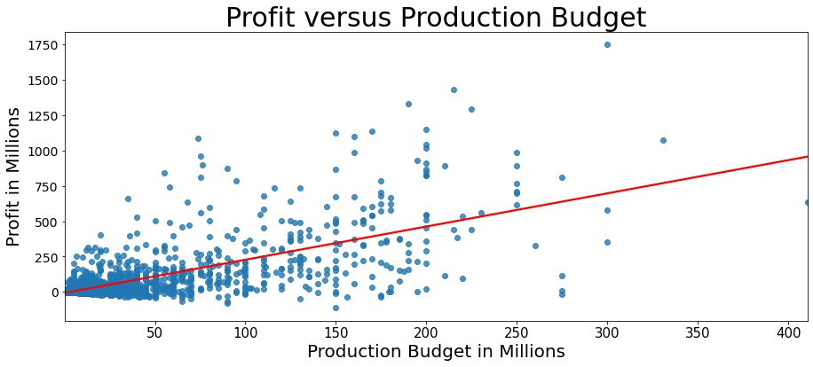
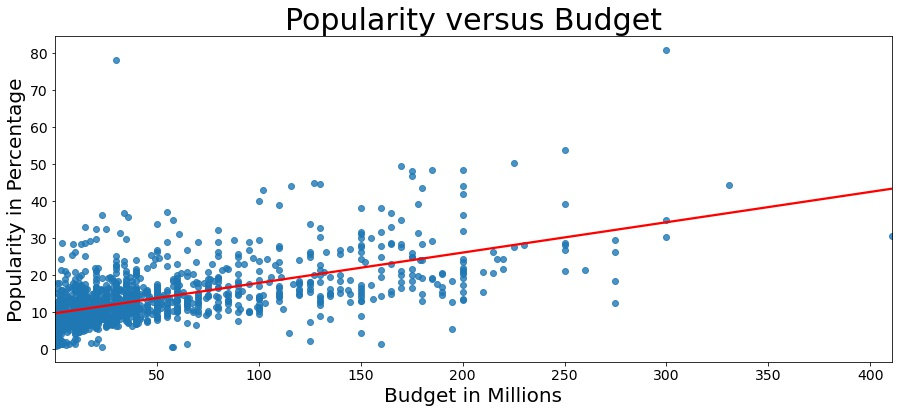

# What makes a movie popular and profitable?
Aurthors: Cooper Thompson, John Daniels, and Bryan Arteaga

# Overview
Data was gathered from imdb(Internet Movie Database), tmdb(The Movie Database), and The Numbers database to find trends that lead to the most profitable and popular movies. Budget, genre, and release month were looked to see how they effect the profitability and popularity. We found postive trends to putting more money into a movie tends to lend more profit and popularity, but definitely isn't guaranteed. The fact that the same trend is send in profit and popularity is definitely encouraging to the accuracy of it. There was three genres that stood about all the others when combind the profit and popularity of each genre. In the same vein, there were three months that stood above and beyond all the others. With the trends seen in these three categories, we have solid recommendations to the best avenues to making movies.
# Business Problem
Microsoft is making their own movie studio, and they aproached us here at MMC(Money Making Corp.) with the question how do budget, genres, and release month affect the profitability and popularity of movies. After find the trends in the data, we have recommendations in all three of those avenues. With that said we do understand from a business side that nothing we say is a gaurentee that profit will be made. There is always inherent risk in the movie making industry, but we definitely have found trends that give higher chance to be successful.
# Data Understanding
As mentioned above in overview we gathered data from imdb(Internet Movie database), tmdb(The Movie database), and The numbers database. The data is not as complete as it could be and with more time, more data could be gathered for more accurate trends.
#### Sources
- https://www.imdb.com
- https://www.themoviedb.org
- https://www.the-numbers.com
# Data Preparation
We then cleaned each of the dataframes we got from those sites. If you want to see the data cleaning steps we took, there is a notebook named Offical Data cleaning in Coopers notebook file. We took the data from each data frame and cleaned them up by taking the steps to make the gross and budget into integers. We then limited the data to only the movies that had at least $50,000 budget since mircrosoft is wanting to spend more than that on their projects. We had to turn the release date into dateTime format. We took steps to try and make sure all the formats for the movie titles were the same. We then went through the steps of merging the three tables together using the name of the movies and the release year. We had lots of duplicates that we dropped at this point. We realized we had some extreme outliers. We dealt with these by dropping any data points that were more than 3X the standard deviation above the mean in ROI (Return on Investment). Also dealt with the low end outliers by dropping the movies that had made less than \$50,000 in worldwide gross because in our research, most of these movies had false data in them. Also dropped the movies that had less than 75 minute runtimes because once again some of these movies had false data in them. Outside of the dropping duplicates and the merging of the tables, the most data points lost to any of these cleaning techniques was 31 movies. At the very end of the data cleaning, we were left with 1266 movies to work with.
# Data Exploration
## Exploring Budget Data
First we wanted to explore how the budget was related to profit and popularity. To do this we first plotted the profit of each movie versus the budget of the movies. This would allow us to see if there was a trend of how much profit oyu make compared to the money you put in.

As seen above, the relationship between the production budget and profit is of moderate positive relationship. As the production budget increase there is going to be an increase in proft. Which won't always be the case for a couple of outliers. Regardless, this proves our point that if you have a greater production budget, then you'll have a greater chance at profit.

Next we wanted to see how budget was related to the popularity of the movie. To do this we ploted the relationship between the two. This would allow us to see if there is a trend between them and if it is similar to our trend in profit versus budget.

As seen above, the relationship between the production budget and popularity is of moderate positive relationship. This shows that on average as your production cost goes up the popularity of the movie goes up. This obviously isn't gaurenteed, but defiently gives a higher chance. If I had more time I would look into how much those few top end outliers skews the data. Also would look into adding more movies to the data to get a greater sammple size.
## Exploring Genre Data
When it came to diving into genre data, we first wanted to find the genres made the most profit. To do this, we used a bar graph to plot genres versus average profit for that genre. This would show the genres that produce the highest profit, and we would be able to see if any genres stand above the others.

Animation, sci-Fi, and adventure are clearly much higher than the other genres. There is a big drop off after Adventure. This provides very clear instructions to give to microsoft about profit. Lets see if this genres are also high in popularity.

The next step after seeing the profit per genre, was to see which genres are the most popular. To do this we use another bar graph to show the average popularity of that genre. This would allow us to see if any genres are more popular than the others. Also allows us to see how animation, sci-Fi, and adventure stand in the popularity ratings.

Look at that, Sci-fi and adventure are the top 2, and animation is still in the top group before the drop off. This very much goes along with how our average profit graph looked. Those clearly are three great genres for microsoft to target.
## Exploring Release Month Data
The final topic of data we looked at was to see if there was a best month or group of months to release a movie based on profit. To do this we graphed the the average profit movies make in each month.

After seeing this data, it is very clear the best time to release a movie is during the summer months. This makes it very easy to recommend Microsoft to release their movies in the summer months (May-July).
# Results
After going through all the data and find all the trends in that data. We have three recommendations for microsoft. 
### Recommendations for Microsoft:
- Emphasize Putting more money into the budgets of the movies. Since we saw there was a positive correlation between budget and the profit. This obviously is not gaurenteed, but has a higher likelyhood. This also has back up in the form of we saw the same trend in that the more budget the more popular the movie. The fact that both of these show the same trend helps the trend be stronger.
- Target Sci-Fi, Animation, and Adventure as these were far and way the highest profit per genre and in the very top group of popularity per genre.
- Target Summer months for release time as this showed by far the highest avergage profit per movie.
# Next Steps
After going through all of this data, there became some clear steps that would need to be taken next. 
- Gather more movies. This allows for the data to have more data points and makes the trends more reliable. Also allows more avenues to go down to analyze the data.
- Look into the high end outliers in the data. Do this to see how much those data points skew our trends and to try and find trends in those outliers to try and become one of those.
- Look into how the director and lead actor/actress impact the profit and popularity of the movie.